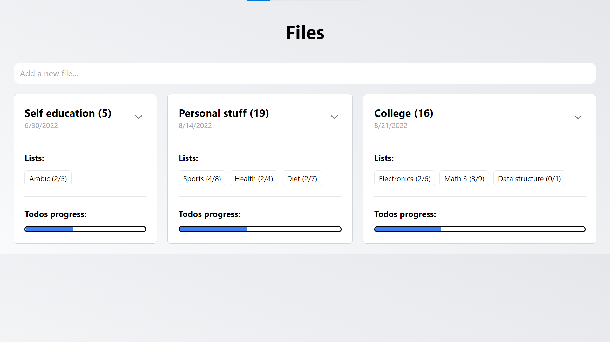
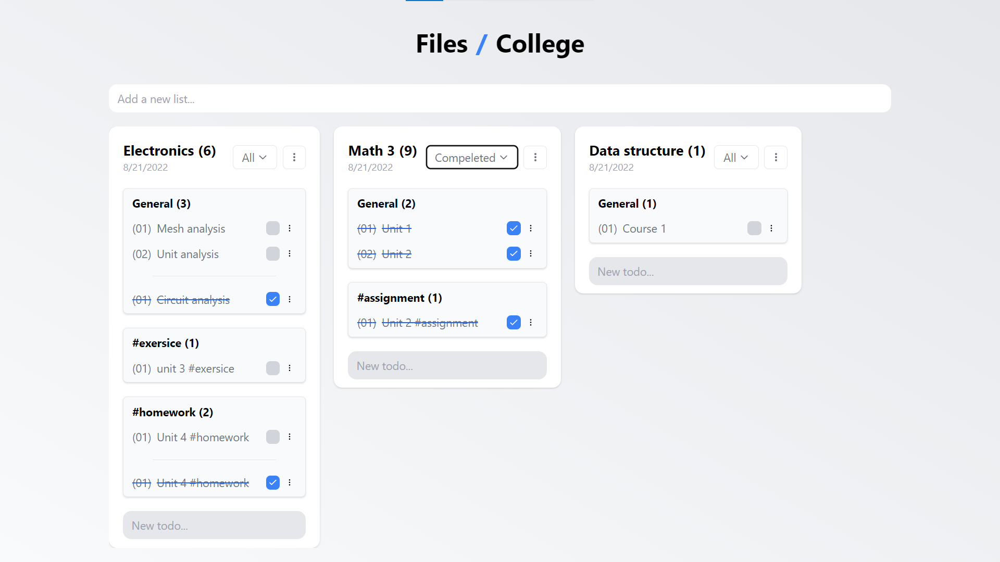
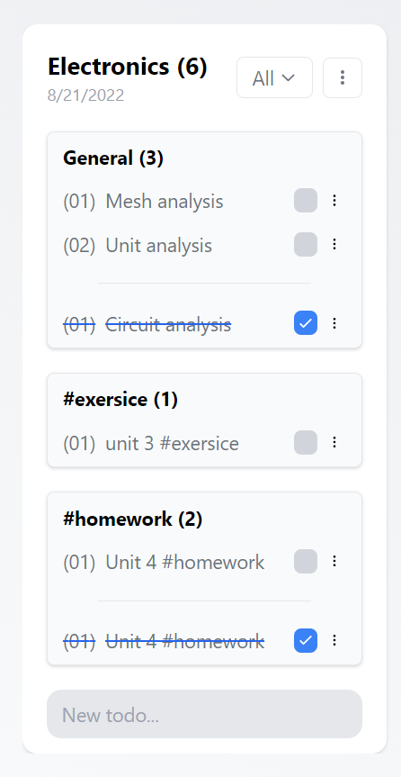

# React organizer

## Inspiration

I really enjoy using productivity applications, and what would be more enojyable than making my own productivity app, in this project I made a good handy todo list app with features like categorizing my todos into files and lists and even categories with the hashtag sign, with tracking the progress of completed todos in every file.

## Live preview

Live preview hosted on netlify, [here](https://react-organizer.netlify.app/).

## Installation

The installation is pretty straightforward:

1. Clone the repe on your local machine.
2. Install all required dependencies, then start the development server by running the following commands:
```bash
$ npm i
$ npm start
```
3. To build the project, run:
```bash
$ npm run build
```

## Breakdown

You have files, every file contains lists, every list contains labeled todos, to label a todo insert `#<your_label>` seprated by spaces in the todo text.

Examples: `unit 4 #homework`, `unit 3 #exersice`

## Preview

#### Files view:


#### File containing some lists:


#### A list containing categorized/labeled todos:


## Used technologies:

* React JS
* Tailwind JS
* Typescript
* Zustand
